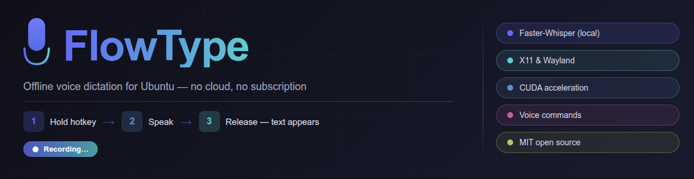

# FlowType



Voice dictation for Ubuntu 24/25. Hold a hotkey — speak — release. Text is transcribed offline and typed at the cursor.

Works on both **X11** and **Wayland**.

## Features

- **Offline or cloud** — local transcription via [faster-whisper](https://github.com/SYSTRAN/faster-whisper), or any OpenAI-compatible API (OpenAI, Groq, etc.)
- **Low latency** — persistent audio stream, model stays in memory; CUDA gives ~0.7 s for 17 s of speech
- **Any hotkey** — single key or combo (e.g. `Right Shift`, `Ctrl+Alt`, `Ctrl+F9`)
- **Smart injection** — clipboard-based paste with automatic terminal detection (uses `Ctrl+Shift+V` in terminal emulators)
- **System tray** — quick access to settings and transcription history
- **Visual indicator** — live frequency equalizer at the bottom of the screen while recording

## Requirements

- Ubuntu 24.04 or 25.04 (x86-64)
- Python 3.10+
- NVIDIA GPU optional (CUDA for fast transcription)

## Install

Download the latest `.deb` from [Releases](https://github.com/vitiodev/flowtype/releases) and install:

```bash
sudo dpkg -i flowtype_1.4.4_amd64.deb
sudo apt-get install -f   # fix any missing dependencies
```

Then launch:

```bash
flowtype
```

The app starts in the system tray.

## Usage

1. Open **Settings** from the tray icon to choose your hotkey, Whisper model, and language
2. **Hold** the hotkey to start recording (pill indicator appears)
3. **Release** to stop — text is transcribed and typed at the cursor

## Settings

| Option | Default | Description |
|--------|---------|-------------|
| Hotkey | `Right Shift` | Key or combo to hold while speaking |
| Mode | `Local` | `Local` (faster-whisper) or `API` (OpenAI-compatible) |
| Model | `base` | Local: `tiny` / `base` / `small` / `medium` / `large` |
| Language | auto | Force a language (e.g. `ru`, `en`) or leave auto |
| Device | `cpu` | `cpu` or `cuda` (requires NVIDIA GPU) — local mode only |
| Inject method | auto | `clipboard` or `ydotool` (Wayland) |

Larger models are more accurate but slower to load and transcribe.

## API transcription (Groq / OpenAI)

Switch **Mode → API** in Settings to transcribe via a cloud API instead of running a local model.

| Field | Description |
|-------|-------------|
| **API URL** | Endpoint base URL (without `/audio/transcriptions`) |
| **API Key** | Your API key |
| **Model name** | Model to request (e.g. `whisper-1`, `whisper-large-v3`) |

**Groq** offers a free tier with fast `whisper-large-v3` transcription:

| Field | Value |
|-------|-------|
| API URL | `https://api.groq.com/openai/v1` |
| API Key | Get one at [console.groq.com/keys](https://console.groq.com/keys) |
| Model name | `whisper-large-v3` |

Any OpenAI-compatible server works (local [whisper.cpp](https://github.com/ggerganov/whisper.cpp) server, OpenAI, etc.).

## GPU acceleration (CUDA)

If you have an NVIDIA GPU, select **Device: cuda** in Settings. The app handles CUDA library paths automatically via the bundled pip packages.

Recommended models for CUDA: `medium` or `large-v3`.

## Building from source

```bash
git clone https://github.com/vitiodev/flowtype
cd flowtype/src
python3 -m venv venv
source venv/bin/activate
pip install -r requirements.txt
python flowtype.py
```

To build the `.deb` package:

```bash
cd deb
dpkg-deb --build flowtype_1.1.0_amd64 ../flowtype_1.4.4_amd64.deb
```

## Architecture

| File | Role |
|------|------|
| `flowtype.py` | Main app, Qt signals between threads |
| `hotkey.py` | evdev keyboard listener, combo hotkeys |
| `recorder.py` | Persistent `sounddevice.InputStream` |
| `transcriber.py` | faster-whisper wrapper + OpenAI-compatible API client |
| `injector.py` | Text injection via clipboard (xclip + xdotool) |
| `config.py` | JSON config at `~/.config/flowtype/config.json` |
| `ui/` | PyQt6 tray, indicator, settings, history |

## Voice Commands

FlowType can execute shell commands triggered by voice. Open **Commands** from the tray icon to manage them.

Each command has:

| Field | Description |
|-------|-------------|
| **Voice phrase** | What you say to trigger the command (e.g. `открой терминал`) |
| **Shell command** | What gets executed (e.g. `gnome-terminal`, `xdg-open https://google.com`) |
| **Exact match** | Off — phrase can appear anywhere in the transcription; On — must match exactly |
| **Run in terminal** | Paste the command into the active terminal window instead of running silently |

Commands are stored in `~/.config/flowtype/commands.json`. A set of default Russian-language commands is included out of the box:

```
"открой терминал"        → gnome-terminal
"открой браузер"         → xdg-open https://google.com
"открой файловый менеджер" → nautilus
```

When a phrase is recognised, the shell command runs **instead of** typing the transcribed text.

## Running from terminal

After installing the `.deb`, the `flowtype` command is available system-wide:

```bash
# Normal launch (starts in system tray)
flowtype

# Launch in background, keep terminal free
flowtype &

# Launch and see live transcription log in terminal
flowtype
# Output example:
# [flowtype] → "текст который вы продиктовали"
# [flowtype] No speech detected.
```

To run from source without installing:

```bash
cd flowtype/src
source venv/bin/activate
python flowtype.py
```

To add to autostart (runs on login):

```bash
mkdir -p ~/.config/autostart
cat > ~/.config/autostart/flowtype.desktop <<EOF
[Desktop Entry]
Type=Application
Name=FlowType
Exec=flowtype
Hidden=false
X-GNOME-Autostart-enabled=true
EOF
```

## Credits

Developed by [Claude](https://claude.ai) (Anthropic AI).
Inspired and driven by **vitiodev**.

## License

MIT — open source, free to use, modify, and distribute.
